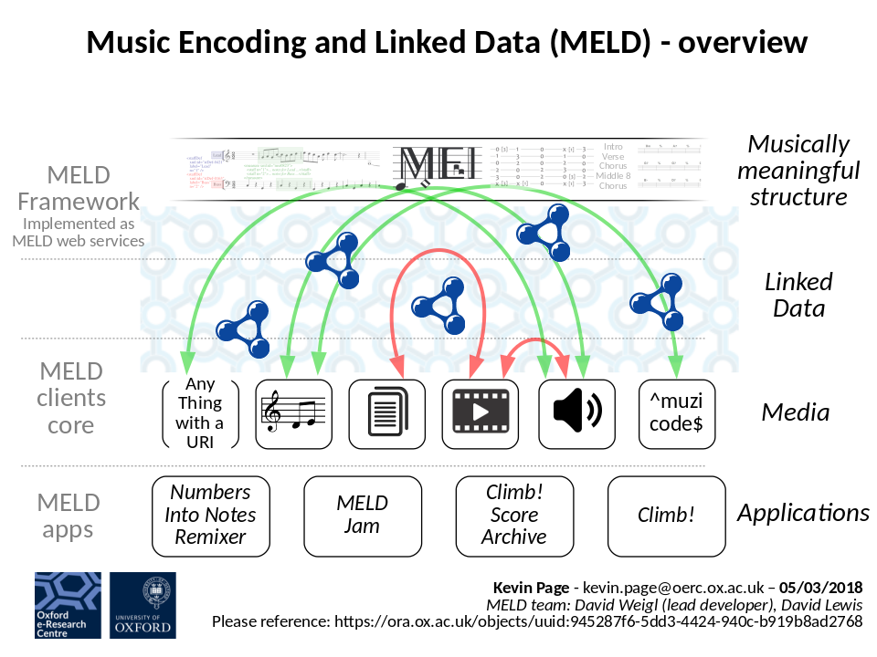

MELD: Music Encoding and Linked Data
====================================
See ISMIR 2017 paper: https://ora.ox.ac.uk/objects/uuid:945287f6-5dd3-4424-940c-b919b8ad2768

Running MELD services
---------------------
* cd server
* pip install -r requirements.txt  #(or use a virtualenv)
* source set_env.sh
* python manage.py runserver #(default port: 5000)

Running MELD client 
-------------------
(seeAlso: http://github.com/oerc-music/meld-client)

* git clone git@github.com:oerc-music/meld-client
* cd meld-client
* npm install
* npm start #(default port: 8080)

Creating a session 
------------------

To start a new session use the MELD session service as follows:

curl -H "Content-Type: application/json" -H "Slug: SessionName" -d '{
"@type": ["mo:Performance", "ldp:BasicContainer"], "mo:performance_of":
{ "@id": $SCORE_URI } }' -v http://127.0.0.1:5000/sessions

n.b., the Slug is optional (it just expresses a preference for the URI
of the resulting session).

The $SCORE_URI corresponds to the conceptual score that the session is
presenting (mo:performance_of).

After the POST you should get back a response with status 201 and a
"Location" header telling you the $SESSION_URI of the new session.

You can then load the session in the jam client by going to:

http://127.0.0.1:8080/Jam?session=$SESSION_URI

Posting an annotation
---------------------

Annotations can be posted through the client user interface, or directly to the session LDP container (Annotation Service). You will need to
add a "Content-Type" header with value "application/json" for the
server to process them properly. To avoid race conditions and
accidental overwriting, we use ETags (file hashes) which  need to be
supplied with each POST. The sequence is as follows:

1. Perform a GET on the session URI, read the ETag header value from
the response
2. POST the annotation to the session, supplying the same ETag value as
 the "If-None-Match" header
3. Check the response status. If it's 201 (CREATED), we're done. If
it's 412 (PRECONDITION FAILED), the file changed before our POST got
through - so repeat from step 1.

**Further documentation soon - in the meantime, feel free to contact @musicog (david.weigl@oerc.ox.ac.uk) for help.**
